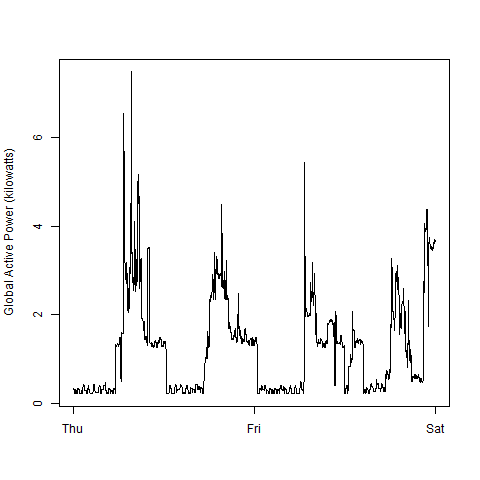

## Introduction

This repository is part of the course assignment.

Following the four plots created as part of the tasks. There are 4 R scripts files. One for each plot.

### Plot 1

 

### Plot 2

 

### Plot 3

 

### Plot 4

 

